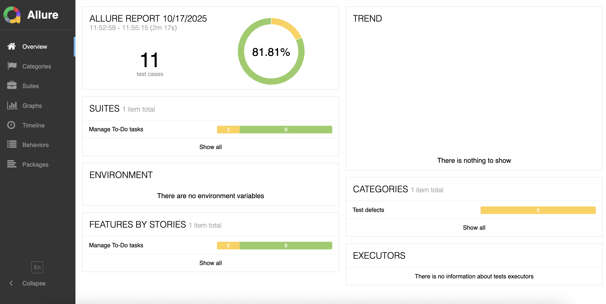
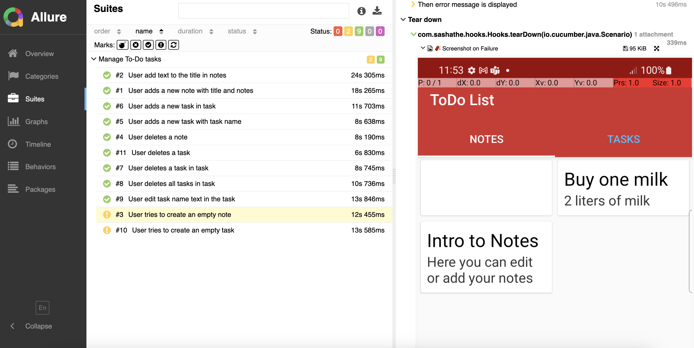

# 📱 Android To-Do App – Automated Tests (Appium + Java + Cucumber + Allure)

## 🧩 Overview
This project contains **automated UI tests** for the Android "To-Do App" using:
- **Appium** for mobile automation
- **Java + TestNG + Cucumber (BDD)** for structured and readable tests
- **Allure Reports** for beautiful and detailed HTML reports with screenshots

The goal of this project is to simulate real user scenarios — adding, editing, and deleting notes and tasks — fully covering all key flows of the To-Do application.

---

## 🚀 Tech Stack
| Tool | Purpose |
|------|----------|
| **Java 17** | Programming language |
| **Appium 8.6.0** | Android mobile automation |
| **Selenium 4.20.0** | WebDriver engine used by Appium |
| **Cucumber 7.14.0** | BDD framework for behavior-driven tests |
| **TestNG** | Test runner |
| **Allure 2.24.0** | Reporting framework with screenshots |
| **Maven** | Dependency and build management |

---

## 🧠 Project Structure
```
android-todo-tests/
├── src/test/java/com/sashathe/
│    ├── pages/      → Page Object classes
│    ├── steps/      → Step Definitions for Cucumber
│    ├── hooks/      → Driver setup and teardown
│    └── tests/      → Test Runner (RunCucumberTest)
├── src/test/resources/features/  → Cucumber .feature files
├── pom.xml          → Maven configuration
└── README.md        → Project description
```
---

## 🧪 How to Run Tests

### 1️⃣ Start Appium Server
Start Appium Desktop or Appium Server CLI manually.

### 2️⃣ Connect your Android device
Make sure your device is visible:
```shell

adb devices
```
### 3️⃣ Run all tests via Maven
```shell

mvn clean test
```
### 4️⃣ Generate and view Allure Report
```shell

allure serve allure-results
```
This command will open an interactive report in your browser.

---

## 📸 Example Allure Report

Below are real screenshots from Allure Reports generated in this project:

### 🧭 Dashboard overview


### 🧪 Test details with screenshot


---

## 🧾 Test Scenarios Covered

✅ Add, edit, and delete notes

✅ Add, edit, and delete tasks

✅ Create and remove subtasks (tasks within tasks)

✅ Validation of empty inputs

✅ Delete all tasks functionality

✅ Verification of popups, redirects, and UI text updates

Total: 11 BDD Scenarios covering all major app features.

---

## ⚙️ Run Configuration

- **Platform:** Android 12+
- **Device:** Samsung Galaxy S21 (real device)
- **Automation Name:** UiAutomator2
- **IDE:** IntelliJ IDEA

---

## 🎯 Purpose of the Project

This is an educational and portfolio project designed to:

- demonstrate the ability to build a complete Appium test framework from scratch
- apply BDD with Cucumber for readability and maintainability
- generate professional Allure reports with screenshots
- simulate a real QA workflow for Android applications

---

## 👨‍💻 Author

**Aliaksandr Nikalaichyk**  
📍 Warsaw, Poland

🔗 [GitHub](https://github.com/sashathe90)  
💼 [LinkedIn](https://www.https://www.linkedin.com/in/aliaksandr-nikalaichyk-02b669230/)  
✉️ [sashathe90@gmail.com](mailto:sashathe90@gmail.com)

---

## 🏁 Quick Summary

**Tech Stack:** 🧩 Appium • Java • Cucumber • TestNG • Maven • Allure  
**Tests:** 🧪 11 BDD Scenarios  
**Reports:** 📊 Interactive Allure with screenshots  
**Purpose:** 🎓 Educational demo project for Junior/Mid **Mobile Automation QA** portfolio